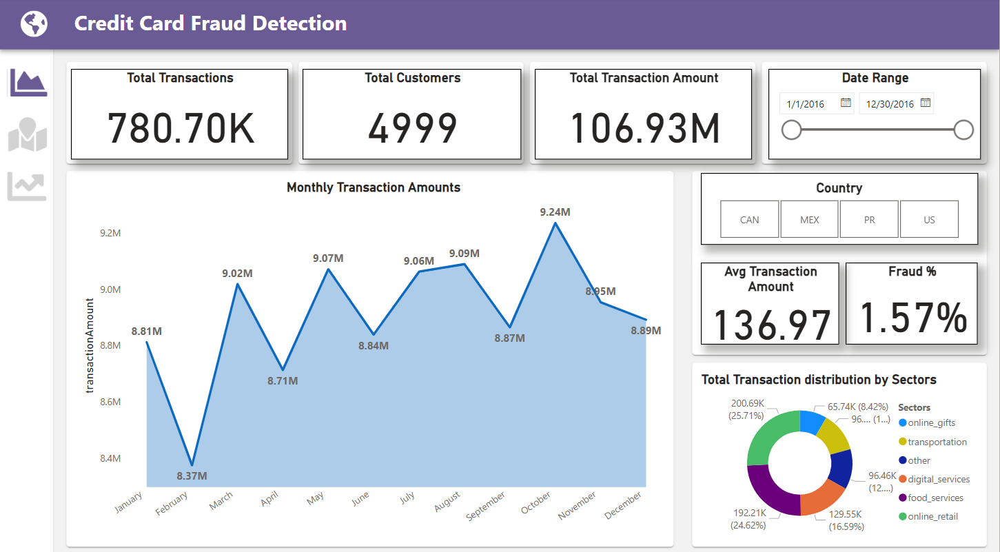
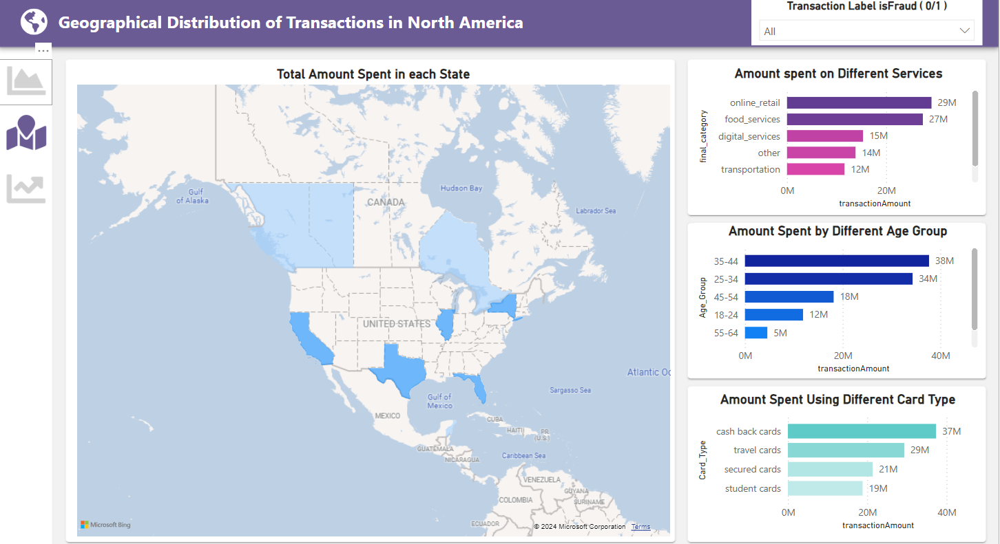
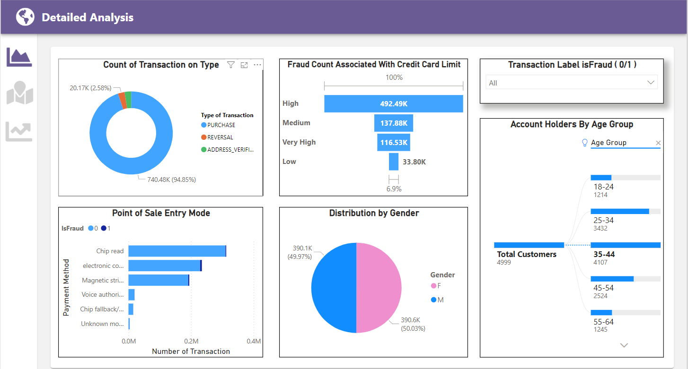

# Credit Card Fraud Detection

## Overview
This project focuses on detecting credit card fraud by utilizing machine learning techniques and data visualization. The goal is to identify fraudulent transactions from a dataset of financial transactions, improving detection accuracy and efficiency. The project is divided into two main parts: model development and dashboard visualization.

## Dataset:
Please download the dataset via the link : https://github.com/CapitalOneRecruiting/DS

## Table of Contents
1. [Project Description](#project-description)
2. [Features](#features)
3. [Technology Stack](#technology-stack)
4. [Installation](#installation)
5. [Usage](#usage)
6. [Model Evaluation](#model-evaluation)
7. [Visualization Dashboard](#visualization-dashboard)
8. [Results](#results)
9. [Contributing](#contributing)

## Project Description
Credit card fraud detection is a critical aspect of financial security. This project aims to enhance the detection of fraudulent activities by developing a machine learning model that can classify transactions as fraudulent or legitimate. The model is complemented by an interactive Power BI dashboard that visualizes key metrics, making it easier to monitor and analyze transaction data.

## Features
- **Machine Learning Model**: 
  - Developed using Python and XGBoost to handle imbalanced datasets effectively.
  - Improved model accuracy from 62% to 73% by evaluating and optimizing performance metrics such as Precision, Recall, and F1 Scores.
- **Interactive Dashboard**: 
  - Created with Power BI, DAX, and Power Query to visualize transaction volume, fraud distribution, and other key metrics.
  - Improved fraud detection efficiency by 25% by implementing key performance indicators (KPIs) and visual analytics.
  
## Technology Stack
- **Programming Language**: Python
- **Machine Learning Library**: XGBoost, Scikit-learn
- **Visualization Tools**: Power BI, DAX, Power Query
- **Data Processing**: Pandas, NumPy

## Installation
### Prerequisites
- Python 3.7+
- Power BI Desktop
- Jupyter Notebook

### Steps
1. Clone the repository:
    ```bash
    git clone https://github.com/yourusername/fraud-detection.git
    ```
2. Install the required Python packages:
    ```bash
    pip install -r requirements.txt
    ```
3. Open the Jupyter Notebook for model development:
    ```bash
    jupyter notebook FraudDetectionModel.ipynb
    ```
4. Load the Power BI `.pbix` file in Power BI Desktop for visualization.

## Usage
1. **Model Training**:
   - Run the `FraudDetectionModel.ipynb` notebook to train the machine learning model on the dataset.
   - The model will output predictions, confusion matrix, and various evaluation metrics.

2. **Dashboard Visualization**:
   - Open the `fraud_detection.pbix`[Download](https://mega.nz/file/2upmlJRb#cv6iK_dsAa8mzyzJ_qyPYMC79CIpe7f4Pde8YOI7YwU) file in Power BI Desktop.
   - Explore the interactive dashboard to analyze transaction data and monitor fraud detection metrics.
     
   - Page 1 

   - Page 2
   
   - Page 3
   

## Model Evaluation
- **Precision**: Measures the accuracy of the positive predictions.
- **Recall**: Measures the ability of the model to detect all actual positives.
- **F1 Score**: Harmonic mean of Precision and Recall, providing a balance between the two.
- **Confusion Matrix**: Provides insight into true positives, true negatives, false positives, and false negatives.

## Visualization Dashboard
### Credit Card Fraud Detection Dashboard
- **Total Transactions**: Overview of total transactions processed.
- **Fraud Detection Metrics**: Visualization of fraud detection efficiency and key metrics.
- **Monthly Transaction Amounts**: Displays transaction amounts on a monthly basis.
- **Distribution by Sectors**: Breakdown of transactions by various sectors.

### Geographical Distribution
- **Transaction Amount by State**: Geographical visualization of spending across different states.
- **Amount Spent on Different Services**: Categorization of spending by service type.

### Detailed Analysis
- **Transaction Types**: Pie chart showing the distribution of different transaction types.
- **Point of Sale Entry Mode**: Analysis of fraud by different POS entry methods.
- **Gender and Age Distribution**: Demographic breakdown of customers.

## Results
- Improved fraud detection efficiency by 25%.
- Increased model accuracy from 62% to 73% using XGBoost.
- Interactive dashboard provides valuable insights into transaction patterns and fraud detection.

## Contributing
Contributions are welcome! Please fork the repository and submit a pull request to contribute to this project.

